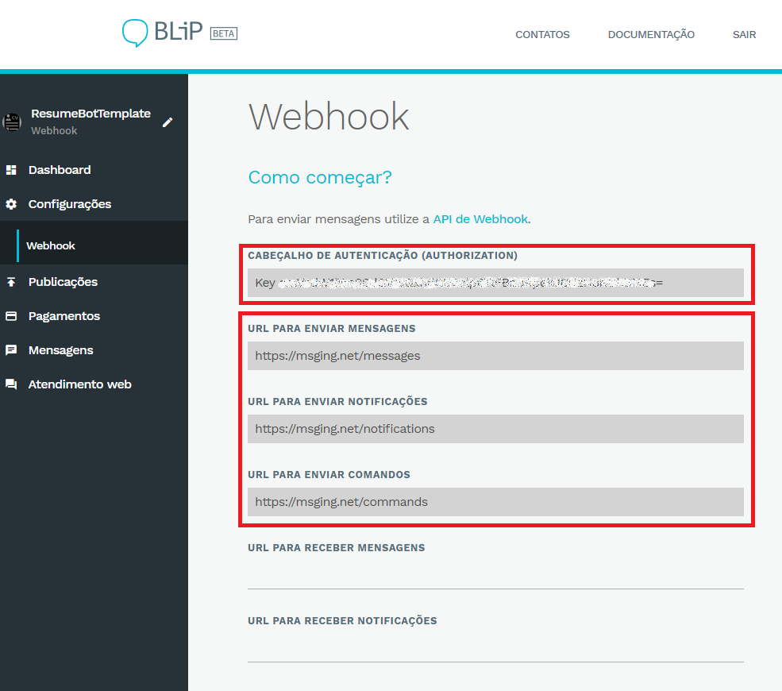

<span class="evidence">Observação: Este post foi originalmente escrito para o [blog](http://blog.blip.ai/2016/11/05/resumo-chatbot-webhook.html) do blip.ai</span>

Através da plataforma [blip.ai](https://blip.ai/) você consegue criar chatbots (também conhecidos como 'bots', 'smart contacts', contatos inteligentes ou contatos que entregam serviços) 
nos principais canais de menssageria do mercado, como: [Facebook Messenger](https://www.messenger.com/), [Telegram](https://telegram.org/), [Skype](https://www.skype.com/), SMS, Whatsapp 
(em breve) ou pelo aplicativo [Blip](https://play.google.com/store/apps/details?id=net.take.omni) disponível para android.

O Blip.ai entrega ao desenvolvedor duas formas diferentes para a construção dos chatbots. A primeira delas é através dos SDK's [C#](https://github.com/takenet/messaginghub-client-csharp/) e 
[JavaScript](http://takenet.github.io/messaginghub-client-js/), neste modelo o desenvolvedor tem total flexibilidade para incluir o chatbot em sua aplicação. 
A outra forma de realizar a integração é através de um [Webhook](https://blip.ai/portal/#/docs/webhook). De forma simplista, um Webhook é a exposição de um endpoint http em sua aplicação 
para possibilitar que API's de terceiros faça requisições em seus serviços. Nesta estrutura o Blip.ai realiza requisições em um endpoint definido pelo desenvolvedor do bot sempre que 
novas mensagens ou notificações estiverem disponíveis. Outra vantagem é não estar amarrado as nenhuma linguagem específica para construir seu chatbot.

O objetivo deste artigo é demonstrar, passo a passo, a criação e publicação de um chatbot **currículo**, através do [blip.ai](https://blip.ai/), utilizando o modelo de integração *Webhook*. 
Para isso será implementado um chatbot *simples* que responderá à alguns comandos básicos sobre informações de um profissional hipotético.

## Sobre o chatbot 'currículo'

Atualmente, quase todo profissional possui um currículo no formato tradicional. Folha A4, tópicos relevantes, preferencialmente com no máximo 2 laudas e algumas seções básicas como: 
*informações gerais*, *formação acadêmica*, *experiência profissional*, *principais habilidades* e *alguma proeficiência em línguas* por exemplo. Existem também versões menos tradicionais 
no formato digital, como portifólios, jogos e vídeos explicativos. Recentemente, com a explosão dos chatbots como nova interface de interação entre pessoas e serviços, surgiram alguns 
trabalhos que utilizam esta nova tendência conversacional para apresentar suas experiências profissionais. Destaco aqui, os trabalhos de 
[Esther Crawford](https://medium.com/the-mission/how-i-turned-my-resume-into-a-bot-and-how-you-can-too-f03847352baa#.3hw9lyi3a) e 
[Caio Calado](https://medium.com/@caio_caladoo/ola-caiobot-meu-linkedin-como-um-chatbot-no-messenger-9db6fa736f70#.4awx67ut0) como referências para este assunto.

Assim, nosso objetivo aqui é representar, a partir de um chatbot, as informações mais importantes sobre a carreira de um profissional. 

Para simplificar vamos reduzir o escopo do chatbot para tratar apenas os seguintes cenários:

1. Envio de informações gerais: Nome, idade, telefone, email e site
2. Envio de informações sobre formação acadêmica
3. Envio das principais experiências profissionais
4. Envio de uma lista com as principais habilidades

Embora seja possível, não vamos nos preocupar, inicialmente, com uma interpretação elaborada de linguagem natural. O artigo do André Bires 
([Construíndo um chatbot assistente virtual utilizando o Textc](http://blog.blip.ai/2016/10/17/chatbots-com-textc.html)) dá algumas dicas de como utilizar a biblioteca Textc para melhorar 
a interpretação de texto de seu chatbot.

## Mãos a obra

### Criando seu chatbot

Antes de mais nada, precisamos criar um novo contato (chatbot) na plataforma [blip.ai](https://blip.ai/).

1. Basta acessar a plataforma, fazer login e clicar no botão **Criar Contato**
2. Escolha o modelo para desenvolvedores **Webhook**
3. Preencha as informações básicas de seu chatbot (nome e foto)

### Criando uma API para receber as requisições do blip

Para este artigo utilizarei uma [ASP.NET Web API](https://www.asp.net/web-api) desenvolvida em C#. Entretanto tenha em mente que a tecnologia escolhida para construir a API não importa, escolha 
aquela que lhe for mais conveniente. Para ver um exemplo de webhook utilizando uma API escrita em Node.JS veja este [post](http://blog.blip.ai/2016/10/24/criando-um-bot-para-busca-imagens-BING.html).

1. Crie um novo projeto de uma *ASP.NET Web API* no VisualStudio

O mínimo que precisamos fazer agora é criar dois endpoints na API, um para receber as mensagens enviadas pelos usuários de seu chatbot e outra para receber notificações.

2. Crie um Controller para Mensagens, com uma action **Post**

```csharp
public class MessagesController : ApiController
{
    // POST api/messages
    public async Task<IHttpActionResult> Post(JObject jsonObject)
    {
        Console.WriteLine($"Message Received: {jsonObject}");

        return Ok();
    }
}
```

3. Crie um Controller para Notificações, com uma action **Post**

```csharp
public class NotificationsController : ApiController
{
    // POST api/notifications
    public void Post([FromBody]JObject jsonObject)
    {
        Console.WriteLine($"Received Notification  {jsonObject}");
    }
}
```

### Publicando a API no azure

Mais uma vez essa é uma escolha pessoal. Você pode publicar sua API onde se sentir mais confortável, no Azure, AWS, Heroku ou na infrastrutura privada de sua empresa. A única coisa que precisamos é 
de um endereço externo, público e válido. A API criada neste arquivo foi publicada no endereço http://resumebottemplate.azurewebsites.net.

### Configuração dos endpoints no portal Blip

1. Vá até o portal blip.ai, selecione seu chatbot e clique **Configurações** na barra lateral esquerda.

2. Insira os endpoints de sua API nos campos 'Url de Mensagens' e 'Url de Notificações' (por exemplo: **http://resumebottemplate.azurewebsites.net/api/messages** e **http://resumebottemplate.azurewebsites.net/api/notifications** no meu caso)

Pronto, seu chatbot já está devidamente configurado e pronto para receber a regra de resposta das mensagens. 

### Implementado as respostas de seu chatbot

Conforme destacado anteriormente, nosso chatbot não terá uma regra muito complexa. O objetivo aqui é apenas provocar o leitor para mais uma aplicabilidade dos chatbots. 
Neste sentido, o chatbot será capaz de interpretar comandos de texto com as seguintes sentenças:

<table>
  <tr>
    <td><b>Sentenças (palavras aceitas)</b></td>
    <td><b>Ações</b></td>
  </tr>
  <tr>
    <td><i>info</i> | <i>informação</i> | <i>about</i></td>
    <td>Envia informações gerais</td>
  </tr>
  <tr>
    <td><i>formação</i> | <i>formacao</i> | <i>education</i></td>
    <td>Envia dados sobre formação acadêmica</td>
  </tr>
  <tr>
    <td><i>experiência</i> | <i>experiencia</i> | <i>experience</i></td>
    <td>Envia as principais experências profissionais</td>
  </tr>
  <tr>
    <td><i>habilidade</i> | <i>skills</i></td>
    <td>Envia uma lista com algumas habilidades</td>
  </tr>  
</table>

Pensando nisso seu chatbot precisará, logo que receber uma mensagem, identificar se o conteúdo enviado bate com algum dos comandos listados acima.
Mas antes de começar lembre-se que **todo conteúdo enviado (ou recebido) para o chatbot** deve seguir o **padrão dos tipos aceitos pelo blip.ai**. 
Neste [link](https://blip.ai/portal/#/docs/content-types) é possível encontrar todas as opções disponíveis. Para este artigo vamos utilizar apenas o tipo **texto**, conhecido como 
[PlainText](https://blip.ai/portal/#/docs/content-types/text).

```csharp
public class MessagesController : ApiController
{
    public MessagesController()
    {
    }

    // POST api/messages
    public async Task<IHttpActionResult> Post(JObject jsonObject)
    {
        Console.WriteLine($"Message Received: {jsonObject}");

        var content = message["content"].Value<string>();
        var from = message["from"].Value<string>();
        var messageContent = "";

        switch (content.Trim())
        {
          case "info":
          case "informação":
          case "about":
            messageContent = "Meu nome é Jonh Lorem Foo, eu tenho 25 anos. \n\nVocê pode me encontrar por telefone: +55 31 99999 9999 ou através do meu email: loremfoo@ipsum.com";
            break;

          case "formação":
          case "formacao":
          case "education":
            messageContent = "*Mestre em Física Nuclear pela NASA\n*Graduado em Economia pela Faculdade de Harvard - USA";
            break;

          case "experiência":
          case "experiencia":
          case "experience":
            messageContent = "Possuo 10 anos de experiência em análise de dados complexos. Meus últimos trabalhos foram para:\n\nGoogle\nFacebook\nNSA\nMicrosoft";
            break;

          case "habilidade":
          case "skills":
            messageContent = "Principais habilidades: \n\nComunicador\nExtrovertido\nGosta de trabalhar em equipe\nProgramação Android";
            break;

          default:
            //default message if user send a unknow command
            messageContent = "Oi, eu sou o chatbot do Jonh :) \nPosso lhe passar várias informações profissionais sobre ele. \n\nSe quiser saber mais me mande um dos comandos abaixo: \n\n about \n education \n experience \n skills!";
            break;
        }

        var replyMessage = "{'id': '"+ Guid.NewGuid() + "', 'to': '" + from + "', 'type': 'text/plain', 'content': '" + messageContent + "'}";
        await ReplyMessageAsync(replyMessage);

        return Ok();
    }
}
```

Caso a mensagem enviada possua alguma das sentenças o chatbot deverá responder o conteúdo específico daquele comando. 
Para isso será necessário enviar uma mensagem de resposta para o usuário com as informações referentes a pergunta.

O método ReplyMessageAsync(string text) envia uma mensagem de resposta com um texto qualquer.

```csharp
public class MessagesController : ApiController
{
   private readonly WebClientService webClientService;

   public MessagesController()
   {
       webClientService = new WebClientService(new Uri("https://msging.net/messages"), "aXhkYWJocXVpemJvdDpGN2VsaW0ya3Vpc0FQNFhWT0pHbg==");
   }
        
   // POST api/messages
   public async Task<IHttpActionResult> Post(JObject message)
   {
     ... Código de tratamento das mensagens recebidas pelo chatbot 
   }

   private async Task ReplyMessageAsync(string message)
   {
       var response = await webClientService.SendMessageAsync(message);
   }
```

Para isso foi utilizado um client Http simples que executa um post em uma url específica da plataforma blip. Note que para enviar a resposta é necessário
obter a Url de resposta e a chave de autenticação no portal blip. Vá nas **Configurações** de seu chatbot no menu lateral esquerdo e copie as url's para envio de mensagens e notificações. A imagem abaixo ilustra onde obter as informações a url para envio de mensagem e a chave de acesso.



Finalmente, se o conteúdo recebido não for compatível com nenhuma das sentenças aceitas (default case) o chatbot responderá uma mensagem padrão explicando ao usuário quais são os comandos aceitos.

### Publicando e testando seu chatbot

Para testarmos nossa aplicação vou publicá-la no Facebook Messenger. 

1. Para isso, basta ir até o portal blip.ai e clicar na opção **Publicações**, no meunu lateral esquerdo
2. Depois escolha o seu canal de preferência (por exemplo **Facebook Messenger*)
3. Siga o passo a passo indicado e seu chatbot já estará disponível.

A imagem abaixo mostra uma interação simples com o chatbot.


[Clique aqui](https://m.me/744908842324712) para testar o ResumeBotTemplate no Facebook Messenger.

## Conclusão

Neste artigo discutimos um pouco sobre uma aplicação válida para um chatbot, um currículo digital. De forma rápida e simples foi apresentado um passo a passo de como criar, configurar
e publicar um chatbot, usando Webhook, através do [blip.ai](https://blip.ai/).

Todo o código desenvolvido para este artigo está disponível no [github](https://github.com/takenet/messaginghub-docs/tree/master/samples/webhook/ResumeBot) com informações *fake*. Caso tenha gostado sinta-se a vontade para utilizá-lo como template para criar o seu chatbot currículo.
Nos próximos dias continuarei evoluindo este chatbot, em meu [repositório](https://github.com/ravpacheco/resumebot). Fique atento, para cada nova versão publicarei novos posts.     
