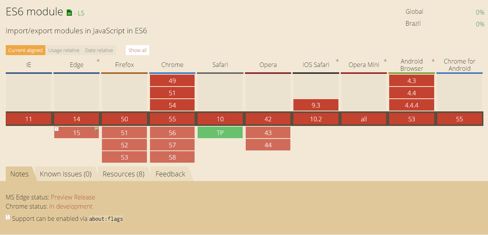

Nos últimos anos, tenho trabalhado em projetos que demandam conhecimentos em aplicações backend, mobile e frontend (web). Profissionais com este perfil, são 
conhecidos, a algum tempo, como desenvolvedores [*fullstack*](https://medium.freecodecamp.com/full-stack-between-reality-and-wishful-thinking-43110005f2a2#.hlwnnxmf7), 
por conseguirem navegar em meio a toda essa pilha de informação.

Não pretendo discutir se desenvolvedores devem ser especialistas ou generalistas, mas na minha opinião, especialmente aqueles que precisam (ou desejam) 
desempenhar um papel "fullstack" precisam conhecer ao menos o básico de todos os lados (mobile, backend e frontend) e **dominar** ao menos um deles. Particularmente, 
sempre tive uma maior inclinação por backend, especialmente para os ecossistemas C# e JAVA. Entretanto, nos últimos meses, devido ao momento dos projetos 
que participo, venho sendo forçado a mergulhar um pouco mais fundo no extenso ambiente frontend. Durante esse mergulho, confesso que fiquei assustado e precisei, 
por várias vezes, voltar a superfície para dar uma respirada ;) . Este post é apenas um relato sobre uma dessas voltas à superfície. 

É fato que a quantidade de novas ferramentas e frameworks que surgem, constantemente, para auxiliar o desenvolvimento web geram um oceano de informação quase infinito.
Por tanto, aqui vai a primeira dica. Não tente nadar para todos os lados, é muita coisa pra vasculhar e grande parte delas é replicada ou até mesmo desnecessária, em 
um primeiro momento. 

> Meu objetivo neste texto é apresentar ferramentas interessantes que me deparei e como cada uma delas pode ajudar no desenvolvimento aplicações web de 
qualidade.

As três tecnologias necessárias para desenvolver qualquer aplicação web são HTML, CSS e Javascript e por isso, dominar os elementos básicos de cada uma delas é 
uma premissa.

# HTML + CSS

Não tenho grandes habilidades para desenhos e elementos gráficos, por isso quando se trata de HTML e CSS fico apenas no feijão com arroz. Sugiro apenas que avaliem alguma 
ferramenta de preprocessamento sintático para a geração de arquivos de estilo. As duas principais do mercado são [SASS](http://sass-lang.com/) e [LESS](http://lesscss.org/). 

# Javascript

No ano passado (2016), o EcmaScript 6 (ou apenas ES6) foi apresentado, trazendo consigo grandes avanços para a linguagem, especialmente no tratamento das estruturas de dados. 
Se você ainda não leu nada a respeito sugiro que o faça. Deixo aqui a indicação de um livro (http://exploringjs.com/es6.html) que pode ajudar a esclarecer os 
principais aspectos dessa mudança.

Até o momento em que este post foi escrito, os browsers ainda não suportam a nova especificação ES6, então para utilizar esses recursos é necessário um mapeador (ou 'transpilador') de código.
O [babel](https://babeljs.io) é a ferramenta que realiza a tarefa de transformar seu código ES6 para um código ES5 capaz de ser executado em qualquer browser.

Compatibilidade de ambientes é um problema antigo na computação. Implementar uma aplicação em um ambiente e garantir que a mesma executará corretamente em vários outros
não é tarefa simples. Infelizmente essa também é a realidade das aplicações web. Vários são os exemplos de funcionalidades que não estão presentes em 
alguns browsers ou que foram implementadas de maneira diferente em cada um dos fabricantes. Por isso, criar uma aplicação e garantir que ela executará de maneira 
correta, para todos os seus clientes, demanda um certo esforço.

Pensando nisso, o projeto [**Can I use**](http://caniuse.com/) apresenta de forma rápida e simples uma análise sobre o suporte dos princiais browsers a diversas funcionalidades.
A figura abaixo mostra um exemplo desta ferramenta, neste caso foi analisado o suporte dos browsers ao ES6. Repare que nenhum browser apresenta suporte para essa tecnologia.

Outra ferramenta bastante útil quando se trata de compatibilidade é o [**testling**](https://ci.testling.com/). Essa ferramenta analisa a compatibilidade de sua aplicação em todos os principais 
browsers, podendo inclusive ser utilizada como um estágio de seu pipeline de integração contínua.

Durante o processo de criação e distribuição de sua aplicação podem ser necessárias algumas tarefas auxiliares, como a geração de "bundles", compactação de arquivos de resources 
ou a "compilação" (preprocessador) de alguns artefatos. Caso seu projeto demande alguma ferramenta deste tipo, a tendência é que seu mergulho comece a ficar bem divertido. Escolher 
uma, dentre as várias opções destas ferramentas pode ser algo bem complicado, Gulp, Grunt, Webpack e npm são apenas alguns exemplos. Pessoalmente, como não tenho um grande domínio 
da área, ainda não possuo uma preferencia ou justificativas para a escolha de uma ou outra. Ao pesquisar sobre o assunto me senti ainda mais confuso. Não existe um consenso
 sobre qual ferramenta utilizar. [Este artigo](https://www.keithcirkel.co.uk/why-we-should-stop-using-grunt/) por exemplo, crítica o Gulp e Grunt e defende que o npm pode ser seu único *build system*.

Apesar de ter uma configuração estranha, no meu ponto de vista, o Gulp realiza suas tarefas bem. Possui vários plugins e exemplos de tasks para vários cenários. Entretanto 
tive muita dificuldade para realizar tarefas de modificação de variáveis durante o processo de geração de bundles. Caso esteja em dúvida sobre o que utilizar sugiro que 
analise o Gulp.

Se sua aplicação já está pronta e publicada talvez seja a hora de analisar sua performance. O [PageSpeed](https://developers.google.com/speed/pagespeed/insights/?url=ravpacheco.com&tab=mobile)
é uma ferramenta do Google muito interessante. Além de analisar a performance de carregamento ele apresenta diversos insights que podem te ajudar a otimizar sua aplicação.

# Conclusão

Por ser muito curioso tenho um inclinação a testar e experimentar diferentes ferramentas durante o processo de desenvolvimento, mas em alguns momentos, a grande quantidade 
de opções de ferramentas pode mais atrapalhar do que ajudar.

Neste post, apresentei um *overview* sobre algumas ferramentas que considero interessantes para a construção de projetos frontend de qualidade, com o objetivo de contextualizar novos navegantes.

* SASS / LESS - pré processadores para arquivos de estilo
* ES6 - nova versão do Javascript
* babel - *transpilador* de código ES5 para ES6
* caniuse - verifica a compatibilidade de diversos elementos da web em diversos browsers
* testling - testes de compatibilidade com os principais browsers do mercado
* Gulp - aplicação para automatização de tarefas (ou *build system*)
* PageSpeed - insights sobre a performance de carregamento de sua aplicação web

O "oceano" web tem se apresentado como um grande desafio pessoal. Por outro lado o sentimento de conquista, em cada pequena descoberta, renova as energias para as braçadas que ainda estão por vir. 
Considero que a curva de aprendizado necessária para dar os primeiros passos na web, ou melhor para as primeiras braçadas, é bem íngrime. Assim espero que 
minhas reflexões possam não só me ajudar a entender um pouco melhor o contexto, como também ajudar aos demais marinheiros de primeira viagem.

Ao longo dos próximos mergulhos, escreverei sobre outras experiências marcantes.  E você, tem algo a compartilhar sobre desenvolvimento frontend ? Deixe sua opinião ou comentário.
