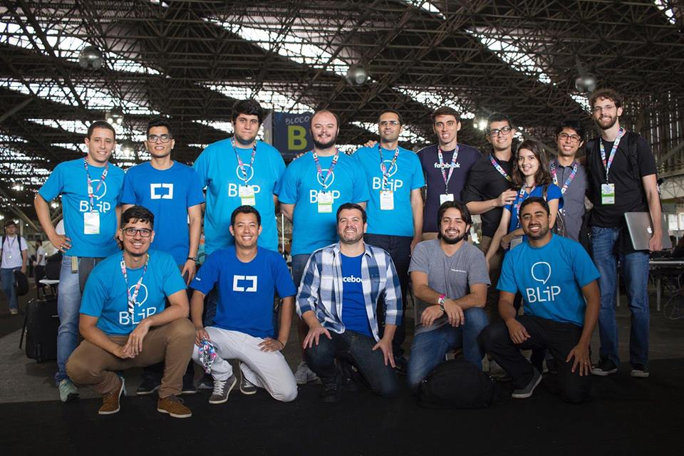
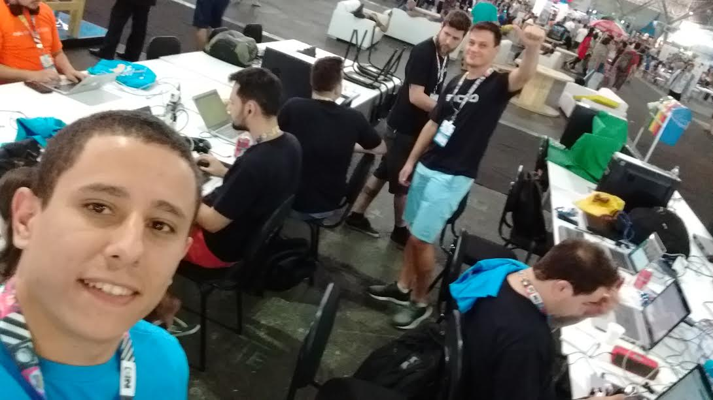
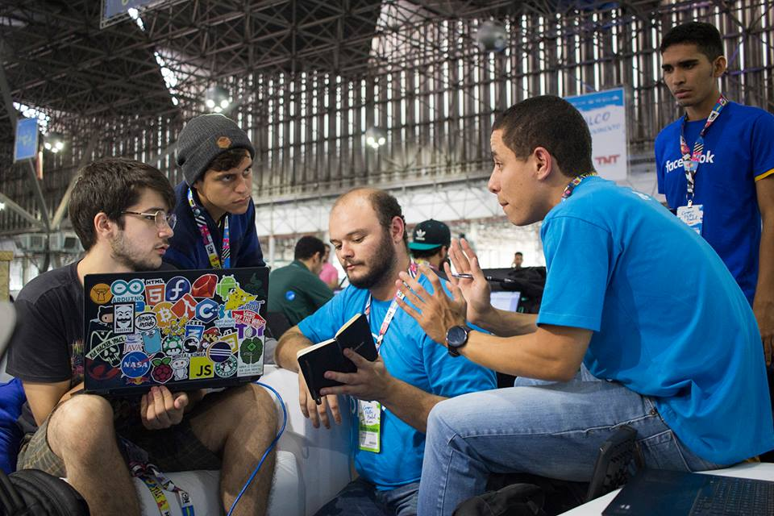
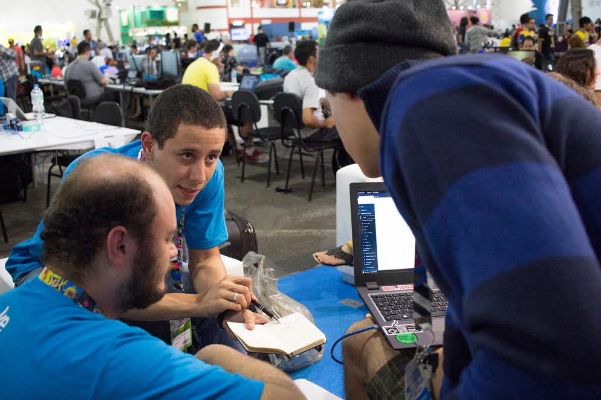
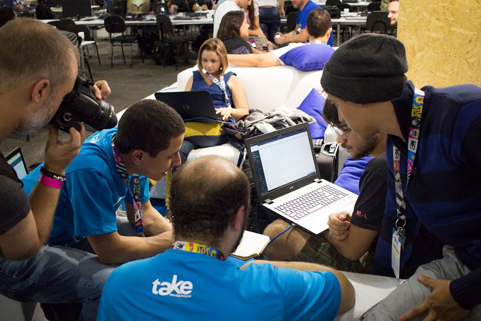

No último fim de semana (02/02/17 a 04/02/2017), participei da Campus Party Brasil 2017 - CPBr10, a convite do Facebook, 
como mentor de seu 1° Botathon (hackathon para construção de chatbots). O convite aconteceu devido a uma parceria 
existente entre a [take](http://take.net/) (empresa que trabalho) e o próprio Facebook. 
O objetivo principal do botathon foi divulgar o Messenger como principal plataforma para o desenvolvimento de 
chatbots.

Para auxiliar os participantes durante o evento, o Facebook convidou as principais empresas brasileiras no 
assunto de chatbots: Take, Calamar, Robosim, Movile e Superare. Por ser um dos desenvolvedores do [BLiP](https://blip.ai/), 
a plataforma da take para construção de chatbots, estive presente para auxiliar os participantes em dúvidas técnicas.

O evento contou com **400 inscritos** (entre designers, desenvolvedores, linguistas, DJ e profissionais de outras áreas), 
**divididos em 95 equipes**. Segundo a organização do próprio Facebook, o evento contou com o envolvimento de 
**mais de 80.000 pessoas** \o/.

Durante as **40 horas do hackathon** tive varias experiências positivas. Troca de ideias, networking, feedbacks 
positivos e negativos sobre nossa plataforma e muito aprendizado. Alem disso tive o prazer de conhecer pessoas 
super legais e atenciosas, que vem contribuindo muito para a expansão do ecossistema de chatbots no Brasil, como 
o Thiago Ueda (da Movile), Rafael Amorim (da Robosim), o Dário dal Piaz (do Facebook) entre outras.

Especialmente para a Take o evento serviu como mais uma grande oportunidade de validação da plataforma [BLiP](https://blip.ai/) 
com seus principais clientes, os desenvolvedores.

Ao longo do evento presenciei o desenvolvimento de várias ideias interessante, algumas ficaram apenas no papel e outras foram construidas 
até o final, com a produção de chatbots incríveis. Os principais destaques, na minha opinião, foram os bots: [MigoBot](https://www.facebook.com/migomessenger/), 
[DietaBuddy](http://m.me/dietabuddy) (do Joselito), BB8 ([Num Pulo](https://www.facebook.com/numpulo)), Muziks além 
do grande vencedor o [PrefeitoBot](https://www.messenger.com/t/prefeitobot/). Destes, apenas o 
MigoBot não foi classificado para a final, mas deixo aqui o meu reconhecimento ao grande trabalho da equipe. 
Quem quiser conhecer mais sobre o MigoBot [clique aqui](https://www.facebook.com/migomessenger/).

A importância de uma equipe multidisciplinar na construção de um chatbot, que realmente faça a diferença para os usuários, ficou evidente com 
o trabalho da equipe DrNutrix, que era composta por exemplo, por uma estudante de nutrição, uma linguísta e um dev. 
Ficou evidente a contribuição de cada integrante ao analisar o resultado final do designer da conversa.

O chatbot BB8, da equipe Num Pulo, deixou claro que os chatbots realmente podem resolver vários problemas atuais 
das empresas. Sua função é melhorar a forma como o projeto [Num Pulo](https://www.facebook.com/numpulo) 
comunica com seus clientes, facilitando a interação e consequentemente reduzindo os custos operacionais da empresa. 
Não tenho dúvidas que, assim como o Num Pulo, diversas outras empresas ainda vão melhorar a forma de interação 
com seus clientes através dos chatbots.

Por ser um desenvolvedor e gostar muito dos desafios do desenvolvimento de software, achei fantástico o 
resultado final do chatbot DietaBuddy. O Joselito **(desenvolvedor e membro único de sua equipe)**, foi muito 
feliz ao integrar diferentes APIS - reconhecimento de imagens e linguagem natural, para produzir seu chatbot. 
O resultado final foi incrível e pessoalmente acho que nenhum outro chatbot foi tão *"inteligente"* quanto o dele. 
Tanto trabalho lhe rendeu inclusive um super convite para trabalhar no **Banco Original**. Parabéns garoto!!!

O grande vencedor (merecidamente, diga-se de passagem), foi a equipe do PrefeitoBot, que soube unir, de maneira fantástica, 
as vantagens da tecnologia à uma ideia de impacto social. O PrefeitoBot tem o objetivo de facilitar a relação 
entre os moradores e os serviços públicos de uma cidade. Além de manter os cidadãos melhor informados, o bot 
possibilita que qualquer pessoa solicite serviços ou faça denúncias sobre problemas em suas comunidades. 
As **features do PrefeitoBot contribuem**, e muito, para a **construção** de **cidades** cada vez mais **inteligentes**.

Uma das principais preocupações da equipe do BLiP é facilitar a vida do desenvolvedor, tornando o processo de 
criação dos bots o mais simples possível. Fico muito feliz em saber que estamos caminhando na direção correta, 
com extensões e SDKs que realmente ajudam o desenvolvedor. Percebi ainda, que mesmo com todos os nossos esforços diários, 
ainda podemos melhorar em alguns pontos, como em nossa documentação. Exemplos e tutoriais autoexplicativos podem 
ser uma saída. Todos os feedbacks foram excelentes e servem de combustível para nos mantermos focado em direção as 
nossas metas.

Acredito que a partir de agora, cada um dos participantes do botathon tem um importante papel de evangelização, 
mostrando as vantagens e pontos de atenção dos chatbots a toda a comunidade brasileira. 
Agradeço mais uma vez ao Facebook pela oportunidade de participar do evento e mais ainda a todos os presentes 
que de alguma forma me ajudaram a crescer ainda mais como profissional. 
A troca de experiências com cada um de vocês foi incrível, muito obrigado! 

**Obs.:** Este texto contou com a ajuda do [Caio Calado (medium link)](goo.gl/lCk2Qm), a quem eu quase sempre recorro quando o assunto é chatbot. 

**Obs.2:** Todas as fotos super legais também foram fotografadas pelo [Caio Calado](goo.gl/lCk2Qm) ;)

