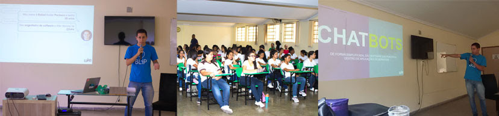

* **Título:** Chatbot - A revolução da comunicação entre pessoas e empresas.
* **Descrição:** Palestra realizada para turmas de ensino técnico em informática de Ribeirão das Neves - MG. Nesta apresentação, discuto um pouco do cenário atual de chatbots e como os mesmos estão transformando a forma como as pessoas conversam com as empresas.

* **Evento:** [Painel: A Revolução das Startups (Sebrae MG)](http://startupsebraeminas.com.br/)

    Este painel é uma das atividades da metodologia BootCamp Empreendedorismo em Ação para alunos do ensino médio e técnico profissionalizante, organizado pelo Sebrae MG. O objetivo principal destes paineis é fomentar o ecossistema tecnológico e promover a inovação de Minas Gerais.
    
    **Mais informações:** [http://www.sebrae.com.br](http://www.sebrae.com.br/sites/PortalSebrae/ufs/mg?codUf=14)

    <iframe src="//www.slideshare.net/slideshow/embed_code/key/Gd4IQXkkOEmiG" width="425" height="355" frameborder="0" marginwidth="0" marginheight="0" scrolling="no" style="border:1px solid #CCC; border-width:1px; margin-bottom:5px; max-width: 100%;" allowfullscreen> </iframe> 
 <strong> <a href="//www.slideshare.net/RafaelAvelar1/chatbot-a-revoluo-da-comunicao-entre-pessoas-e-empresas" title="Chatbot - A revolução da comunicação entre pessoas e empresas" target="_blank">Chatbot - A revolução da comunicação entre pessoas e empresas</a> </strong> de <strong><a target="_blank" href="//www.slideshare.net/RafaelAvelar1">Rafael Avelar Pacheco</a></strong> 
