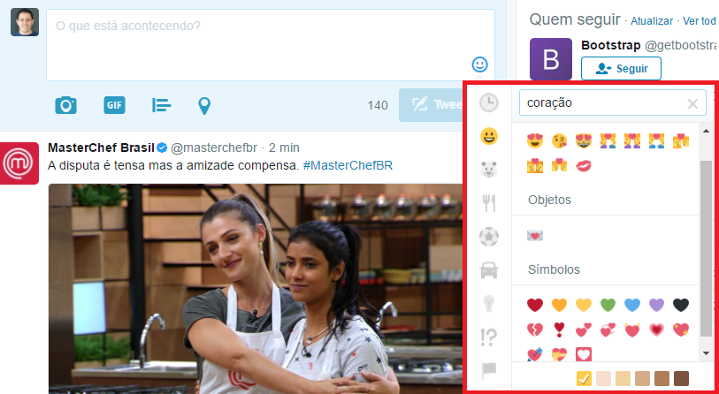

Sabe aquele ditado que diz: "uma imagem vale mais que mil palavras"? Pois é, concordo com ele em muitas situações. 

Atualmente, utilizo vários aplicativos de mensagem: Whatsapp, Messenger, Skype, Slack, Hangouts, email, Twitter, Telegram e o velho e bom SMS. Especificamente no Whatsapp, recebo uma grande quantidade de mensagens todos os dias e em várias ocasiões, minhas respostas tem o objetivo de demonstrar meu sentimento. Durante muito tempo utilizei "hahhahaha", "heheheh", "ashuashuahsua" e "rsrrsrsrs" (nunca gostei do kkkkkk) para demonstrar que achei algo engraçado. De um tempo pra cá, passei a utilizar, simplesmente: 😂 (um emoji).

Lembra do ditado no início do texto? Pois é, nesse caso um emoji vale bem mais que uma palavra ( ou um monte de caracteres ).

Emojis (tambem conhecidos como emoticons, stickers ou carinhas do zapzap) são desenhos que podem ser enviados junto dos textos com o intuito de facilitar (ou tornar mais agradável) o entendimento de algo. Existem [pesquisas](http://www.bbc.com/future/story/20151012-will-emoji-become-a-new-language) que já os consideram, inclusive, como uma pseudo língua dentro das aplicações de mensagem.

Assim como as pessoas tem se acostumado a utilizar emojis em suas converasas ( minha mãe e minha avó utilizam frequentemente 😍 ), os chatbots também tem utilizado bastante deste recurso. [Clique aqui](http://chatbotsbrasil.take.net/afinal-o-que-e-um-chatbot/) caso não saiba o que é um chatbot. Por isso, como um desenvolvedor, constantemente preciso encontrar um emoji ideal para um determinado assunto.

Existem diversos serviços na internet que servem como um catálogo de emojis. Utilizo basicamente o [emojipedia](http://emojipedia.org/) - uma enciclopédia completa de emojis, e o widget do Twitter para fazer minhas escolhas, como na imagem abaixo. O fluxo é bem simples, você informa o nome do emoji e a ferramenta te devolve o emoji.

O problema dessas soluções é que muitas vezes não sei exatamente o nome do emoji que estou procurando. Quase sempre tenho apenas algumas palavras ou um sentimento que gostaria que o emoticon representasse. Por exemplo: "quero emoji de alegria" ou "preciso de algo religioso" ou até mesmo "emoji de amor ou carinho", para estes casos, as ferramentas atuais não funcionam bem.

Pensando nisso, resolvi criar o chatbot "GetEmoji". Ele basicamente te ajuda a encontrar o emoji ideal a partir de uma entrada de texto - palavras ou sentenças curtas, fornecida pelo usuário.

Para construir este chatbot não precisei escrever nenhuma linha de código. Utilizei apenas as plataformas [BLiP.ai](https://blip.ai) e a API Natural Language Classifer (NLC) do Watson. Não vou detalhar todo o processo que utilizei para criar este bot neste artigo, essas são cenas de outro capítulo.

# Espírito Colaborativo

A versão atual do GetEmoji é bem simples e possui várias limitações. A base de conhecimento do bot está restrita a poucos emojis e, por enquanto, ele só aceita sentenças em português.

Pensando nessa evolução, resolvi criar um formulário para que qualquer pessoa consiga "ensinar" novos elementos ao bot.  Caso você utilize o GetEmoji e ele não te responda da melhor maneira possível, ou não envie o emoji que você estava esperando use [este formulário](https://docs.google.com/forms/d/e/1FAIpQLSfOMsqfoV5RmVe-VteL5NqHKtwXtd5hz75Hy9IWNPWRt0Q7OA/viewform?c=0&w=1) para enviar sua contribuição.

Caso esteja interagindo com o GetEmoji pelo Messenger utilize, a qualquer momento, o menu persistente, na opção ajuda, para acessar o formulário. Caso esteja em algum outro canal, envie a palavra "ajuda" que o bot lhe enviará um link para acessá-lo

# Base de conhecimento

A base de conhecimento inicial do GetEmoji possui apenas os emoticons que utilizo com mais frequência. As frases utilizadas para o treinamento dessa base também foram criadas de forma impirica e simplista.

Na última semana, o emojipedia.org lançou um novo recurso que apresenta uma taxa de utilização de cada emoji nos últimos 5 anos. Acredito que o segundo passo seja aumentar a base de treinamento para contemplar ao menos os 100 emoticons mais utilizados no mundo.

Além disso, outro passo importante para a evolução do GetEmoji é realizar as análises de efetividade das respostas através dos feedbacks recebidos, mas isso é tema pra outro post.

Se você gosta de emoticons, curte testar novos chatbots ou tem interesse em utilizar uma ferramenta que te auxilie a encontrar emojis, te convido a testar o GetEmoji. 

Atualmente, ele está publicado nos canais Messenger, email ou na web através do canal BLiP Chat.

* Messenger: [m.me/botgetemoji](https://m.me/botgetemoji)
* Email: envie um email para **getemoji@blip.ai**
* Web: [clique aqui](https://goo.gl/88Nafd) para acessar o GetEmoji na Web

Tem alguma sugestão ? Gostaria de adicionar algum outro emoji ao GetEmoji ? Tem alguma crítica ? Deixe seu comentário abaixo 👇. Se gostar do artigo compartilhe com seus amigos ❤️, quem sabe ele pode ser útil para outra pessoa também! 😉

