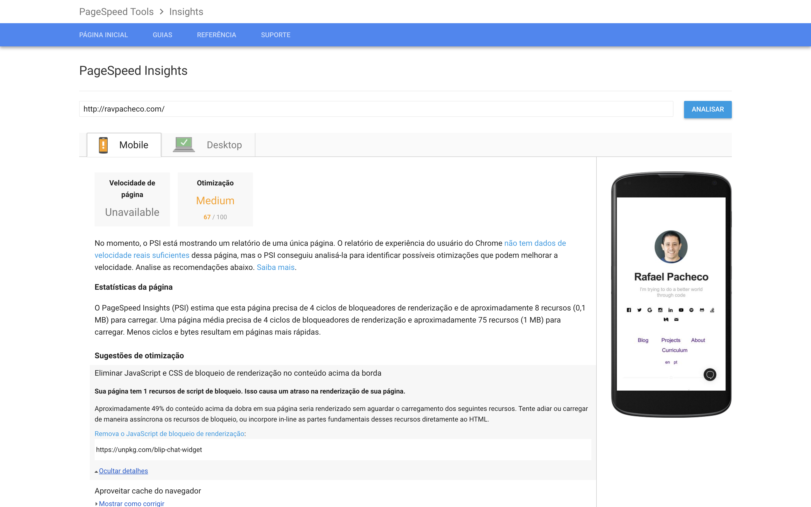
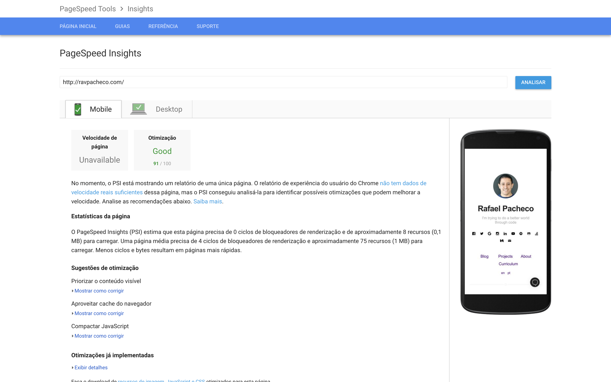

Oferecer uma boa experiência para os usuários, na minha opinião, é uma premissa básica de qualquer software. Especialmente para aplicações web, velocidade de carregamento é uma característica que pode impactar, profundamente, a experiência dos usuários.

Pensando nisso, desde o início de 2018, o Google começou a considerar a [velocidade das páginas web como uma das métricas de seu algoritmo de rankeamento](https://webmasters.googleblog.com/2018/01/using-page-speed-in-mobile-search.html?hl=pt-BR&utm_source=PSI&utm_medium=incoming-link&utm_campaign=PSI). Uma das ferramentas, utilizadas pelo Google, para avaliar a performance das páginas é o PSI - _PageSpeed Insights_, uma ferramenta que indica a perfomance de uma página em relação ao [relatório Chrome UX](https://developers.google.com/web/tools/chrome-user-experience-report/) e sugere otimizações.

Para saber se sua página atende aos critérios definidos pelo PSI, utilize o link [https://developers.google.com/speed/pagespeed/insights/](https://developers.google.com/speed/pagespeed/insights/) e informe o endereço de sua página. Após a análise, a ferramenta dará uma nota de 0 a 100 e apresentará os feedbacks de como melhorar sua aplicação.

Se você está lendo este artigo então conhece meu site [ravpacheco.com](http://ravpacheco.com). 
Quando começei a construío-lo, além do obejtivo de organizar o acesso as todas as minhas informações profissionais, tinha apenas 2 pré-requisitos técnicos: 

* Flexibilidade para extensão - por isso a escolha por uma ferramenta open source **via código**.
* Ser muito rápido - por isso a escolha por algo minimalista (na melhor expressão da palavra).

Recentemente, adicionei no site uma janela de chat que permite qualquer pessoa me enviar mensagens (de forma anônima ou identificada). A janela de chat é um componente da plataforma [BLiP](https://blip.ai), chamado BLiP Chat.

O processo para incluir o BLiP Chat em uma página web é extremamente simples. Basta copiar e colar dois blocos de scripts no HTML de sua página.

```html
<script src="https://unpkg.com/blip-chat-widget" type="text/javascript"></script>
<script>
    (function () {
        window.onload = function () {
            new BlipChat()
                .withAppKey('your-api-key')
                .withButton({ "color": "#222222" })
                .build();
        }
    })();
</script>
```

O arquivo carregado pelo componente (https://unpkg.com/blip-chat-widget) é bem simples e seu tamanho é de apenas alguns Kb.
Para minha surpresa, após adicionar o componente o PSI mobile da minha página caiu 24 pontos.



A justificativa pela queda de pontuação é o fato das tags **scripts** travarem o carregamento do restante da página, enquanto o arquivo do componente é baixado pelo browser.

Para contornar esse problema, uma estratégia simples é adicionar o atributo **async** (sim, apenas 5 caracteres) nos blocos scripts. Scripts que possuem o atributo **async** são executados em asincronamente, antes mesmo de todo o processo de parsing da página.

```html
<script async src="https://unpkg.com/blip-chat-widget" type="text/javascript"></script>
<script >
    (function () {
        window.onload = function () {
            new BlipChat()
                .withAppKey('your-api-key')
                .withButton({ "color": "#222222" })
                .build();
        }
    })();
</script>
```

Após adicionar o atributo **async**, realizei uma nova análise na página e recuperei meus 24 pontos 😉.



Uma outra opção para casos como esses é usar o atributo **defer** (também 5 caracteres) que posterga a execução do script para depois do parsing da página. Para saber mais sobre esses atributos veja os links [[1]](https://www.w3schools.com/tags/att_script_async.asp) e [[2]](https://www.w3schools.com/tags/att_script_defer.asp).

## Conclusão

Resumindo: Apresentei a ferramenta PSI, utilizada pelo Google para metrificar a performance e rankear paginas web, e demonstrei como melhorar a performance da sua aplicação utilizando o atributo **async**.

Gostou da dica? Concorda com meus argumentos? Tem alguma sugestão? Gostaria de sugerir outro ponto de vista ou criticar algo? Deixe seu comentário abaixo 👇. Se gostar do artigo compartilhe com seus amigos, quem sabe ele pode ser útil para outra pessoa também! 😉